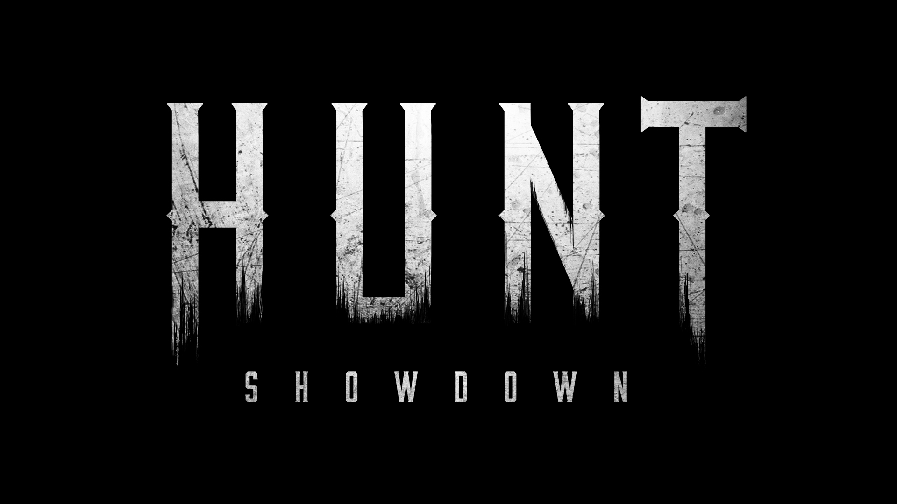

  Hunt_Randomizer: A simple loadout randomizer for Hunt: Showdown

  

## About The Project

This project is a simple tool to randomize the starting loadouts for the Videogame Hunt: Showdown by Crytek.
It is currently updated for Version 1.5 of the game. You can find the current version deployed at:
<https://hunt.distractech.com/>

## Advisory

This was my very first project, and is very limited in scope & technologies used. I regularly use it as a basis for learning and applying newly learned technolgies.
This repository, however, is intended to stay as is - as a a reference point for myself of where I started out.

## Technologies used

- HTML & CSS
- Vanilla Javascript

(very impressive, I know.)

## License

Images and graphics have been provided by Crytek, available in their fankit at <https://www.huntshowdown.com/fankit>.

## Contact

Chris Ackermann
 
Github: [https://github.com/Chris-Ack](https://github.com/Chris-Ack)
 
LinkedIn: [https://www.linkedin.com/in/chris-ackermann/](https://www.linkedin.com/in/chris-ackermann/)
